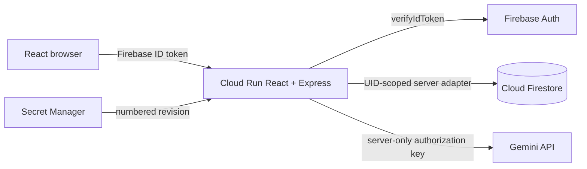

# Daymark

Daymark is a private Gemini journal that turns a conversation into a useful summary while keeping memory under the user's control.

## Live Demo

The Cloud Run deployment is intentionally deferred while account access is unavailable. Use the walkthrough article listed in `docs/submission/HUGGING_FACE_BLOG.md` after publishing it to Hugging Face.

## Problem Statement Alignment

| Challenge requirement         | Daymark evidence                                                                                                                                                            |
| ----------------------------- | --------------------------------------------------------------------------------------------------------------------------------------------------------------------------- |
| Firebase user authentication  | Google Sign-In with session-scoped Firebase Auth in `src/client/features/auth/` and verified Admin tokens in `src/server/middleware/authentication.ts`                      |
| Multi-turn Gemini interaction | Server-only `@google/genai` gateway, bounded history, fallback ladder, and atomic turn persistence in `src/server/features/generation/` and `src/server/features/journals/` |
| Isolated Firestore storage    | Every repository operation derives `users/{verifiedUid}/...`; default-deny browser rules are in `firestore.rules`                                                           |
| Secret Manager key handling   | `GEMINI_API_KEY` is server-only and the numbered Secret Manager binding is documented in `docs/DEPLOYMENT.md`                                                               |
| Original enhancement          | Context Contract proposals require approval, retain source provenance, and support edit, reject, retire, and delete                                                         |

## Features

- Google sign-in with protected routes and no password database.
- Bounded multi-turn journaling with summaries, themes, and next steps.
- User-isolated journal history, export, and recursive deletion.
- Context Contract: Gemini can suggest memories, but only the user can approve durable context.
- Reflection Compass: private topic counts and approved memories for the last 7 or 30 days.
- Plain-text rendering, strict validation, rate limits, safe error envelopes, security headers, and accessible loading and retry states.

## Architecture



## Chosen Vertical

A consentful personal reflection tool for people who want practical journaling without invisible AI memory.

## Approach and Logic

The browser owns only the Firebase session. Express verifies each bearer token and derives the UID; it never trusts a client UID, document path, model, or prompt. A Firestore transaction reserves a turn, enforces quotas and a lease, calls Gemini through a server-only gateway, validates the structured response, and commits the user message, model reply, summary, and memory proposals together.

## How the Solution Works

1. Sign in with Google through Firebase Auth.
2. Create a journal and send plain-text entries to the same-origin API.
3. The server supplies bounded, approved context to Gemini and saves the complete turn atomically.
4. Review proposed memories in the Context Contract panel and approve only what should shape future replies.
5. Use History, Compass, export, or deletion controls to stay in control of the record.

## Assumptions Made

The challenge dashboard accepts a walkthrough article in place of a live prototype link. Cloud resource creation, AI Studio account configuration, deployment, and public posting remain user-owned steps because no account access was granted. No live integration is claimed by the local test suite.

## Tech Stack

React, Vite, TypeScript, Radix Themes, Phosphor Icons, Express 5, Firebase Auth/Admin, Cloud Firestore, `@google/genai`, Zod, Vitest, Supertest, Playwright, axe, and Docker.

## Getting Started

```text
npm ci
copy .env.example .env
npm run dev
```

Set the values in `.env` from your own Firebase project and a current Gemini authorization key. Never commit the file. The Cloud Run path uses Application Default Credentials and Secret Manager rather than a service-account key file.

## Testing

`npm test` runs the unit and API integration suite. Additional release checks are defined in `package.json`: formatting, strict type-checking, lint, coverage, Firestore rules, end-to-end browser checks, build smoke checks, audits, and container verification. Coverage is configured to require 95 percent across statements, branches, functions, and lines; the local candidate must pass that gate before release claims are made.

## Security

Read `SECURITY.md`, `docs/ai-studio/CUSTOM_INSTRUCTIONS.md`, `docs/ai-studio/THREAT_MODEL.md`, and `docs/DEPLOYMENT.md`. The public bundle contains only Firebase browser identifiers. Tokens, journal text, model prompts, model output, and secrets are not written to logs.

## Performance

The client uses route-level lazy loading, compressed same-origin responses, bounded requests, hashed assets, and no source maps in production output. Live Lighthouse and Cloud Run measurements are intentionally not recorded until deployment is authorized.

## Accessibility

The UI uses semantic landmarks, labelled controls, keyboard-visible focus, status announcements, explicit loading and error states, responsive navigation, and reduced-motion-safe CSS. Automated axe and browser checks are part of the release gate.

## Team

Built for the Cloud Run AI Challenge by Auenchanters.

## Submission Materials

- Walkthrough article: `docs/submission/HUGGING_FACE_BLOG.md`
- LinkedIn draft: `docs/submission/LINKEDIN_POST.md`
- Dashboard text: `docs/submission/BRIEF_DESCRIPTION.md`
- Submission checklist: `docs/SUBMISSION_CHECKLIST.md`
