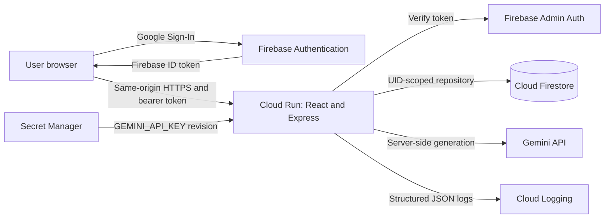

# Daymark Secure Journal Design

## Product intent

Daymark is a private, conversational journal for people who want useful reflection without surrendering control of their memory. A user signs in with Google, talks with Gemini across multiple turns, and receives a concise summary, themes, and a practical next step. Every saved record is scoped to the verified Firebase user.

The original feature is the **Context Contract**. Gemini may propose facts, commitments, preferences, or open questions to remember, but a proposal does not become durable conversational context until the user approves it. Every approved memory keeps its source message references and can be edited, retired, or deleted. This makes AI memory visible, attributable, and reversible.

## Requirements

| ID | Requirement | Acceptance evidence |
| --- | --- | --- |
| R1 | Configure Google AI Studio with security-first custom instructions before code generation. | Versioned instructions, threat model, and AI Studio evidence in `docs/ai-studio/`. |
| R2 | Authenticate with Firebase Google Sign-In. | Sign-in, sign-out, auth persistence, and protected-route tests. |
| R3 | Support real multi-turn Gemini conversations. | Stored message history is sent in bounded order through `@google/genai`; contract tests cover follow-up context. |
| R4 | Persist prompts, Gemini replies, and summaries in Cloud Firestore. | Transactional repository tests and history UI. |
| R5 | Prevent cross-user data leakage. | UID is derived only from a verified Firebase token; two-user negative tests cover every resource route; rules tests enforce owner-only reads and deny client writes. |
| R6 | Keep the Gemini API key out of source and browser bundles. | Server-only environment access, Secret Manager deployment binding, secret scans, and bundle scans. |
| R7 | Deploy one container to Cloud Run with the required verification label. | Reproducible deployment script and post-deploy verification output. Deployment remains blocked until the release gate passes. |
| R8 | Ship an original enhancement beyond the starter. | Context Contract proposal, approval, provenance, edit, and retirement flows. |
| R9 | Be usable, stable, accessible, and production-ready. | Automated unit, integration, rules, browser, accessibility, build, container, and security checks. |
| R10 | Prepare all submission materials. | Public-repository README, walkthrough script, social-post draft, screenshots checklist, and dashboard field checklist. |

## Approaches considered

### Same-origin Cloud Run backend-for-frontend (selected)

A React client and an Express API ship in one container. Firebase handles federated sign-in; the client sends a fresh ID token as a bearer token; the server verifies it with Firebase Admin and derives the UID. Only the server calls Gemini and Firestore.

This removes cross-origin deployment complexity, keeps operational credentials server-side, and creates one auditable authorization boundary. It is the smallest architecture that can still meet the production requirements.

### Browser Firestore plus Gemini gateway

Direct browser reads would provide realtime updates and reduce API code, but would create two authorization systems whose behavior must remain identical. Daymark does not need realtime collaboration, so the additional rules surface is unjustified.

### Separate web and generation services

A private worker behind Cloud Tasks would isolate long Gemini calls and enable durable retries. It also adds IAM, queue, deployment, and failure-state complexity. It is the documented scaling path, not the first release.

## Architecture



The Cloud Run endpoint is public so the sign-in page can load. Every journal, memory, export, and generation route requires a valid Firebase ID token. The API never accepts a UID, model name, system instruction, Firestore path, or safety setting from the browser.

## Technology choices

- Node.js 22 runtime and TypeScript with all strictness flags enabled.
- React, Vite, and React Router for a small code-split single-page client.
- Radix Themes as the single accessible component system and Phosphor as the single icon family.
- Express 5 for the same-origin API and static delivery.
- Firebase Web Auth for Google Sign-In; Firebase Admin Auth and Firestore through Application Default Credentials on Cloud Run.
- `@google/genai` with `gemini-3.6-flash` as primary and the codelab fallback ladder for recoverable failures.
- Zod at every external boundary and for every structured model response.
- Vitest, Testing Library, Supertest, Firebase Emulator Suite, fast-check, Playwright, and axe for verification.

## Data model

```text
users/{uid}
  journals/{journalId}
    messages/{messageId}
    turns/{requestId}
    memories/{memoryId}
  compass/{periodKey}
```

`journals/{journalId}` stores title, bounded summary, themes, reflection tone, next step, message count, version, and server timestamps. `messages` stores ordered plain text with role and source request ID. `turns` stores the idempotency state and stable response reference. `memories` stores typed Context Contract proposals with status, source message IDs, and revision. `compass` stores an optional user-requested retrospective derived only from that UID's summaries and approved memories.

No ID tokens, credentials, rendered HTML, raw HTTP headers, full model prompts, or message content are written to logs. Deletion is recursive because deleting a Firestore parent does not delete subcollections.

## API boundary

| Method and path | Purpose |
| --- | --- |
| `GET /healthz` | Minimal liveness response with no build or dependency metadata. |
| `GET /api/config` | Public Firebase browser configuration only. |
| `GET /api/journals` | Cursor-paginated journals for the verified UID. |
| `POST /api/journals` | Create a journal beneath the verified UID. |
| `GET /api/journals/:journalId` | Load a bounded journal and ordered messages. |
| `DELETE /api/journals/:journalId` | Recursively delete one owned journal. |
| `POST /api/journals/:journalId/turns` | Submit one idempotent user turn and atomically persist the message pair. |
| `PATCH /api/journals/:journalId/memories/:memoryId` | Approve, edit, reject, or retire a proposed memory. |
| `POST /api/compass` | Build a bounded retrospective from only the caller's summaries and approved memories. |
| `GET /api/export` | Export the caller's journal data as JSON. |
| `DELETE /api/account-data` | Recursively delete all journal data for the caller. |

Unknown resource identifiers return the same `404` whether absent or owned by another user. Errors use stable codes and sanitized messages. Internal details exist only in redacted structured logs.

## Turn processing

1. Enforce JSON content type, exact origin, authentication, UID-keyed rate limit, schema limits, and request ID format.
2. Reserve a short Firestore turn lease beneath `users/{verifiedUid}`. A completed duplicate request returns the stored result.
3. Build bounded history from the server-owned system instruction, approved Context Contract items, the current summary, and the newest message window.
4. Call the model through the allowlisted fallback ladder with a deadline and output ceiling.
5. Parse and validate the structured response. Treat every model field as untrusted data, strip HTML/control characters, enforce source provenance, and cap lengths.
6. Commit the user message, model message, summary, journal metadata, and memory proposals in one Firestore transaction.
7. Return the committed response. The client clears its input only after confirmation. Save failures leave the draft intact and expose an accessible retry action using the same request ID.

The first release returns complete JSON instead of streaming. This keeps structured validation and persistence atomic. Streaming is an evolution only after the stored-turn state machine is proven.

## Threat summary

| Zone | Threat | Required controls |
| --- | --- | --- |
| Input surfaces | Oversized input, schema confusion, stored XSS, NoSQL path injection | Strict Zod schemas, maximum lengths, UUID resource IDs, plain-text storage, React escaping, output sanitizer, body limit |
| Planning and reasoning | Prompt injection, system prompt disclosure, durable false memory | Fixed server system instruction, no model tools, structured output validation, approved-only Context Contract, user-visible provenance |
| Tool execution | Secret theft, SSRF, arbitrary model or path selection | No browser Gemini call, no URL-fetching tools, model allowlist, UID-scoped repositories, Secret Manager binding |
| Memory and state | Cross-user IDOR, duplicate turns, race conditions, incomplete deletion | Verified-token UID only, no UID parameters, two-user tests, leases and request IDs, transactions, recursive deletion |
| Inter-system communication | Token leakage, permissive CORS, insecure service identity | HTTPS, exact origin allowlist, redacted logs, dedicated runtime service account, least-privilege IAM, no service-account key files |
| Availability and cost | Generation abuse, model outage, cold starts | Authenticated per-UID limits, request deadlines, documented fallback ladder, instance cap, health checks, warm-instance option during judging |
| Supply chain | Vulnerable or tampered dependencies and leaked credentials | Exact versions, lockfile, audit gates, CodeQL, Dependabot alerts without auto-created event branches, gitleaks, container scan |

## Interface design

The public surface is a left-aligned sign-in composition with one original editorial illustration, a calm off-white and ink palette, and a single moss-green accent. The authenticated product uses Radix Themes, a compact rail, and four routes: Today, History, Compass, and Privacy. Shape rules are 14px surfaces, 10px inputs, and pill buttons. Motion is limited to state transitions and respects reduced-motion preferences.

The journal view keeps the conversation central, the Context Contract in a collapsible side panel, and save state in an `aria-live` region. Loading, empty, error, blocked-model, retry, offline, and deleted states are first-class. Both light and dark themes preserve the same hierarchy and accent.

## Privacy and safety

Daymark is a reflective writing tool, not medical care. The system instruction avoids diagnosis, coercion, dependency language, and claims of professional authority. If a message suggests immediate danger, the response prioritizes contacting local emergency services or a trusted person without pretending to replace professional support.

Users can export or recursively delete their data. Retention is indefinite until deletion in the first release because a silent retention window could surprise users; the Privacy page states this plainly. Analytics, advertising, third-party trackers, sharing, uploads, web browsing, and external notification integrations are intentionally excluded.

## Verification strategy

- Unit tests cover schemas, sanitization, prompt assembly, fallback decisions, auth header parsing, rate-limit keys, error mapping, and Context Contract state transitions.
- API integration tests use injected fake auth, Firestore, and Gemini adapters to prove every route, validation failure, sanitized dependency failure, retry, and two-user negative case.
- Firestore Emulator tests prove owner-only reads, denied client writes, and default deny.
- Property tests exercise sanitizer and UID-scoped path invariants.
- React tests cover sign-in, protected routing, multi-turn submission, retained drafts on failure, retry, memory approval, history, export, and deletion confirmation.
- Playwright and axe cover the unauthenticated path and a hermetic authenticated journey without production bypass code.
- Build smoke tests verify the health body, security headers, `security.txt` body, SPA fallback, no source maps, and no secret-like strings in browser assets.
- Final gates include lint with zero warnings, strict typecheck, formatting, coverage thresholds, dependency audit, secret scan, dead-code scan, duplication scan, Docker build/run, and a fresh-context hostile review.

## Deployment contract

The runtime uses a dedicated user-managed service account with Firestore access and `roles/secretmanager.secretAccessor` granted only on the Gemini secret. Cloud Run receives a numbered secret version through `--set-secrets`; no `GOOGLE_APPLICATION_CREDENTIALS` variable or key file is used. The deployment sets bounded memory, concurrency, maximum instances, startup CPU boost, and the mandatory label `dev-tutorial=cloud-run-ai-challenge`.

No cloud mutation, GitHub push, or public deployment occurs until every local gate is green and the release audit reports no high or critical issue.

